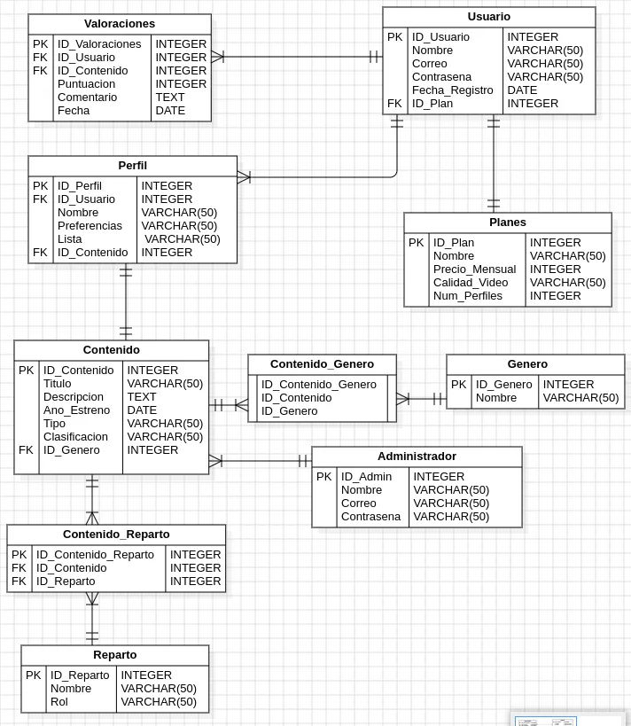

# Nesflis

Este proyecto es una plataforma de streaming desarrollada en Java 17 con Spring Boot y utilizando PostgreSQL como base de datos. La plataforma permite a los usuarios explorar, interactuar y gestionar contenido de películas y series, simulando una experiencia similar a otras plataformas populares de streaming.


## Tabla de contenido

| Index | Titulo |
| ------ | --------------- |
| 1. | Descripcion del Proyecto |
| 2. | Requrimientos del sistema |
| 3. | Instalaciom |
| 4. | Diagrama ER|
| 5. | FAQs|
| 6. | Licencia |
| 7. | Contacto |

# Requisitos del Sistema

Este proyecto está desarrollado utilizando las siguientes tecnologías:

- **Java 17**  
  Lenguaje de programación utilizado para el desarrollo de la lógica del servidor. Java 17 es una versión LTS (Long Term Support) que ofrece características de rendimiento mejoradas, soporte extendido y nuevas funcionalidades para el desarrollo de aplicaciones robustas y escalables.

- **Spring Boot**  
  Framework basado en Java utilizado para simplificar la creación de aplicaciones web y servicios RESTful. Spring Boot facilita la configuración y la implementación de aplicaciones, proporcionando una base sólida para el desarrollo de aplicaciones empresariales con características como la inyección de dependencias, seguridad y persistencia de datos.

- **PostgreSQL**  
  Sistema de gestión de bases de datos relacional (RDBMS) utilizado para almacenar y gestionar los datos de la aplicación. PostgreSQL es conocido por su estabilidad, flexibilidad y cumplimiento con los estándares SQL, ofreciendo una solución eficiente para almacenar información y realizar consultas complejas.

## Requisitos para Ejecutar el Proyecto

Para poder ejecutar este proyecto, asegúrate de tener instalados los siguientes requisitos en tu sistema:

- **Java 17**: [Descargar Java 17](https://jdk.java.net/17/)
- **PostgreSQL**: [Descargar PostgreSQL](https://www.postgresql.org/download/)

Además, se recomienda tener instalado un IDE como **IntelliJ IDEA** o **NetBeans** para facilitar el desarrollo y la ejecución del proyecto.

## Instalacion

Clona el Proyecto

```bash
  git clone https://github.com/Stefanyyy15/Nesflis.git
```

Ve al directorio del proyecto

```bash
  cd Nesflis
```

Directo al archivo

```bash
  code .
```
## Diagrama ER



## Diagrama de clases
[Diagrama en blanco.pdf](https://github.com/user-attachments/files/18476273/Diagrama.en.blanco.pdf)


## FAQs
Lista de preguntas frecuentes:
1. ¿Cómo puedo contribuir al proyecto?
   _Puedes contribuir creando un fork del repositorio y enviando un pull request._

2. ¿Este proyecto está abierto a contribuciones?
   | Tipo de contribución | Aceptado | Comentarios |
   |:---------------------|:--------:|------------:|
   | Reporte de errores   | Sí       | Utiliza la sección de issues en GitHub |
   | Nuevas características| Sí      | Envía un pull request con tus propuestas |

## Licencia

Este proyecto está licenciado bajo la Licencia MIT. 

[](https://choosealicense.com/licenses/mit/)

## Video

https://www.youtube.com/watch?v=TxEFYcGrN1g


## Contacto

Si tienes alguna pregunta o deseas más información, no dudes en contactarme:

- **Nombre**: Michelle
- **GitHub**: [https://github.com/miDaya02](https://github.com/miDaya02)

- **Nombre**: Luis
- **GitHub**: [https://github.com/L-Salamanca](https://github.com/L-Salamanca)

- **Nombre**: Stefany
- **GitHub**: [https://github.com/Stefanyyy15](https://github.com/Stefanyyy15)

---
